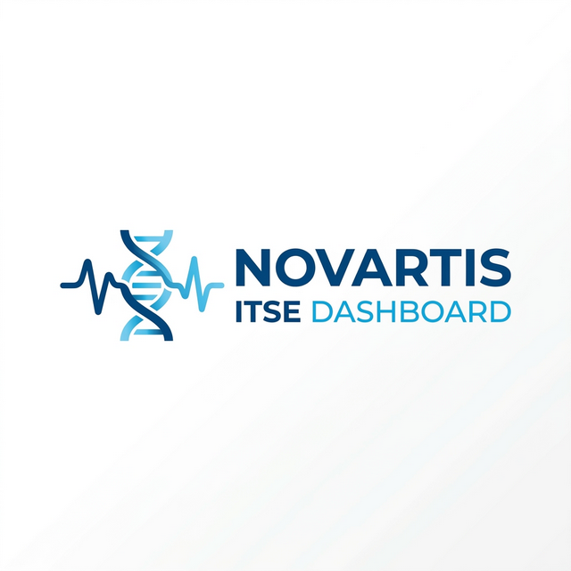
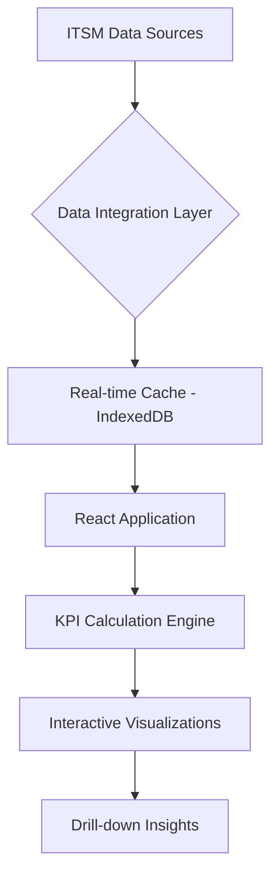

<div align="center">
  
  
  # Novartis ITSE Dashboard v2
  
  [](https://reactjs.org/)
  [](https://www.typescriptlang.org/)
  [](https://vitejs.dev/)
  [](https://tailwindcss.com/)
  [](https://github.com/mrigankad/novartisitsev2/)

  **The next generation of Operational Excellence for Novartis ITSM data.**
</div>

---

## 🚀 Overview

The **Novartis ITSE Dashboard v2** is a sophisticated, real-time operational dashboard designed to optimize ITSM workflows. It provides a comprehensive view of service health, performance metrics, and team productivity through high-fidelity data visualizations.

---

## 📊 Core Modules

### 1. Executive Overview
*   **KPI Tracking:** Real-time visibility into Ticket Volume, SLA Compliance, and MTTR.
*   **Compliance Monitoring:** Deep-dive into SLA Met vs. Breached trends.
*   **Dynamic Trend Analysis:** Visual representation of ticket inflow and backlog movement.

### 2. Operational Intelligence ("My Dashboard")
*   **Regional Distribution:** Breakdown of performance across NA, EMEA, APAC, and LATAM.
*   **Priority Heatmaps:** Real-time status of Critical (P1) and High (P2) incidents.
*   **Resolver Performance:** Tracking lead resolvers and assignment group efficiency.

### 3. Advanced Analytics & Reporting
*   **Excel-Style Leaderboards:** High-performance tables with advanced sorting and filtering.
*   **Drill-down Capabilities:** Access granular ticket-level details directly from charts.
*   **Universal Export:** Seamlessly export any dashboard view to **Excel** or **PDF**.

---

## 🏗️ Architecture



---

## 🛠️ Tech Stack

- **Framework:** React 18 with TypeScript
- **Bundler:** Vite
- **Styling:** Tailwind CSS & Lucide Icons
- **UI Components:** Radix UI primitives
- **Visualization:** Recharts (High-performance charting)
- **Data Management:** Custom context-based state management with IndexedDB caching

---

## 🏁 Getting Started

### Prerequisites

- Node.js (v18+)
- npm

### Installation

```bash
# Clone the repository
git clone https://github.com/mrigankad/novartisitsev2.git

# Navigate to directory
cd novartisitsev2

# Install dependencies
npm install

# Start development server
npm run dev
```

---

## 💎 Features at a Glance

| Feature | Description | Status |
| :--- | :--- | :--- |
| **SLA Tracking** | Real-time calculation of P3/P4 SLA compliance. | ✅ Active |
| **Global Filters** | Cross-filtering by Region, Group, and Date Range. | ✅ Active |
| **Drilldown** | Comprehensive modal views for every data point. | ✅ Active |
| **Export Engine** | High-fidelity Excel and PDF generation. | ✅ Active |

---

<div align="center">
  <sub>Built with ❤️ for Novartis Operational Excellence.</sub>
</div>
